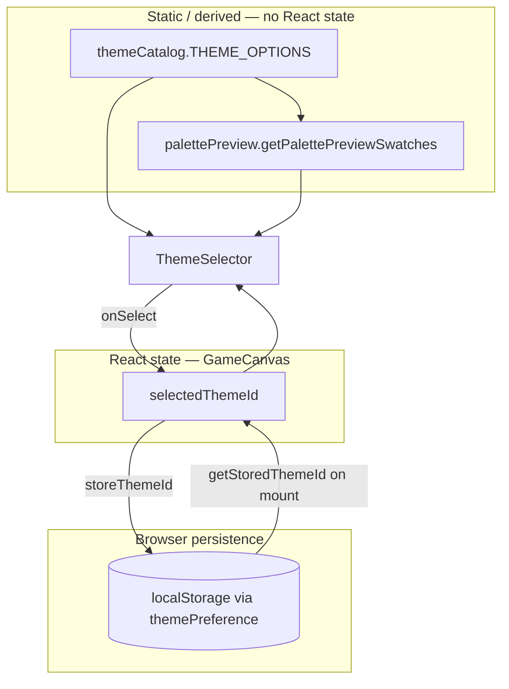
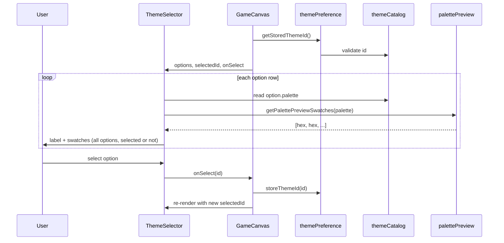

# Architecture: Subtle Palette Preview

## Context

The approved spec ([`agents/runs/2026-07-22-palette-preview-feature/artifacts/spec.md`](agents/runs/2026-07-22-palette-preview-feature/artifacts/spec.md)) breaks work into three milestones: extract theme options + selector, add palette preview logic, then refine display. The product backlog ([`agents/backlog.md`](agents/backlog.md)) lists a theme selector (current palette + two alternates) as a sibling feature; **palette preview depends on that selector existing**, but neither exists in source today.

Colors are currently hardcoded per entity draw method (e.g. `PLAYER_COLOR = "red"` in [`src/game/entities/player/Player.ts`](src/game/entities/player/Player.ts), platform colors in moving-platform modules, `"black"` canvas clear in [`src/game/Game.ts`](src/game/Game.ts)). The ready menu lives in [`src/game/ui/gameMenu/GameMenu.tsx`](src/game/ui/gameMenu/GameMenu.tsx); React ↔ game wiring is in [`src/game/ui/gameCanvas/GameCanvas.tsx`](src/game/ui/gameCanvas/GameCanvas.tsx).

This design adds **palette preview swatches beside each theme option in the ready menu**, scoped to existing conventions: one module per directory under `src/game/`, co-located tests, pure logic separated from React, no new dependencies.

---

## 1. Files involved

### New files

| File | Role |
|------|------|
| `src/game/theme/themeCatalog/themeCatalog.ts` | Static theme definitions (id, label, palette tokens) |
| `src/game/theme/themeCatalog/themeCatalog.test.ts` | Catalog shape and default-theme invariants |
| `src/game/theme/palettePreview/palettePreview.ts` | Pure helper: palette → ordered preview swatch colors |
| `src/game/theme/palettePreview/palettePreview.test.ts` | Swatch ordering, count, and stability |
| `src/game/theme/themePreference/themePreference.ts` | Read/write selected theme id via `localStorage` |
| `src/game/theme/themePreference/themePreference.test.ts` | Default fallback, invalid stored id, missing storage |
| `src/game/ui/themeSelector/ThemeSelector.tsx` | Renders theme options with label + preview swatches |
| `src/game/ui/themeSelector/ThemeSelector.css` | Subtle swatch layout and option-row styling |
| `src/game/ui/themeSelector/ThemeSelector.test.tsx` | Markup tests: swatches present per option, selection state |

### Modified files

| File | Role |
|------|------|
| `src/game/ui/gameMenu/GameMenu.tsx` | Mount `ThemeSelector` in the `ready` phase body |
| `src/game/ui/gameMenu/GameMenu.test.tsx` | Assert theme section renders on home menu |
| `src/game/ui/gameCanvas/GameCanvas.tsx` | Own selected theme state; pass value + change handler to `GameMenu` |
| `src/game/ui/gameCanvas/game-ui.css` | Optional shared spacing token if selector needs menu-level gap (prefer keeping swatch styles in `ThemeSelector.css`) |

### Explicitly out of scope for this feature (follow-up)

| File | Why deferred |
|------|--------------|
| `src/game/Game.ts` + entity draw modules | Applying palette to canvas requires threading colors through ~10 draw sites; preview can ship without it |
| `src/game/ui/gameHud/GameHud.tsx` | HUD uses CSS vars today; theme application there is separate |

> **Convention note:** The spec suggests `src/game/entities/themeOptions.ts` and `src/game/themeSelector.tsx`. Prefer `theme/themeCatalog/` and `ui/themeSelector/` to match the repo’s module-shard rule (see [`.cursor/rules/canvas-game.mdc`](.cursor/rules/canvas-game.mdc)) and the `powerupCatalog` pattern.

---

## 2. Responsibility of each file

### `themeCatalog.ts`
- Defines `GameThemeId`, `GamePalette` (small fixed set of semantic tokens), and `GameThemeOption` (`id`, `label`, `palette`).
- Exports `THEME_OPTIONS` (readonly array): **Classic** (mirrors current hardcoded colors) plus **two alternates** aligned with backlog item #7.
- Exports `DEFAULT_THEME_ID`.
- Single source of truth for colors shown in previews (and later, for canvas theming).

Suggested palette tokens (enough to preview, not every entity):

```
background, player, platform, hazard, accent
```

Map Classic roughly to: `black`, `red`, `green`, `cyan`, `yellow`.

### `palettePreview.ts`
- Exports `getPalettePreviewSwatches(palette: GamePalette): readonly string[]`.
- Returns a stable, ordered list of 4–5 hex/CSS color strings for UI swatches.
- No React, no DOM, no canvas — easy to unit test and explain in interviews.

### `themePreference.ts`
- Mirrors [`playerIdentity`](src/game/leaderboard/playerIdentity/playerIdentity.ts): `getStoredThemeId(): GameThemeId`, `storeThemeId(id)`.
- Validates stored value against `THEME_OPTIONS`; unknown ids fall back to `DEFAULT_THEME_ID`.

### `ThemeSelector.tsx`
- Presentational component.
- Props: `options`, `selectedId`, `onSelect(id)`.
- Each row: accessible control (radio `input` + `label`, or `button` with `aria-pressed`) + **`PalettePreviewSwatches`** inline beside the label.
- Swatches render as small `<span>` elements with `background-color` and `aria-hidden="true"`; the control gets an `aria-label` describing the theme (e.g. `"Neon theme: dark background, pink player, …"`).

### `ThemeSelector.css`
- “Subtle” means: small swatches (~0.6–0.75rem), tight gap, muted border (`--game-border-muted`), no animation, no canvas.
- Row layout: `display: flex; align-items: center; justify-content: space-between` (label left, swatches right) within the existing `--game-menu-width` constraint.

### `GameMenu.tsx`
- In `phase === "ready"`, render `ThemeSelector` above `ReadyMenuActions`.
- Receives `selectedThemeId` and `onThemeSelect` via new props (keeps menu dumb; no localStorage here).

### `GameCanvas.tsx`
- Initializes theme state: `useState(() => getStoredThemeId())`.
- On change: update state + `storeThemeId`.
- Passes theme props into `GameMenu`.
- Does **not** push theme into `Game` until a separate “apply theme to canvas” task — avoids coupling preview UI to a large entity refactor.

### Tests
- **Pure modules:** behavior and edge cases (invalid storage, swatch count).
- **UI:** `renderToStaticMarkup` pattern used elsewhere ([`GameMenu.test.tsx`](src/game/ui/gameMenu/GameMenu.test.tsx), [`Leaderboard.test.tsx`](src/game/ui/leaderboard/Leaderboard.test.tsx)) — assert swatch count, theme labels, `aria-pressed` / `checked` on selected vs unselected options.
- Do **not** test pixel rendering or canvas draw colors for this feature.

---

## 3. State ownership



| State | Owner | Notes |
|-------|-------|-------|
| Theme catalog | `themeCatalog.ts` | Immutable at runtime |
| Preview swatch colors | Derived in render from catalog via `palettePreview` | Never stored separately |
| Selected theme id | `GameCanvas` (`useState`) | Initialized from `themePreference` |
| Persisted preference | `localStorage` via `themePreference` | Written on user selection |
| In-game canvas colors | `Game` + entities (today: hardcoded) | **Not owned by this feature**; future work reads same catalog |

Selection happens only on the ready menu; changing theme while paused/over is unnecessary for v1.

---

## 4. Data flow



**Key requirement:** Previews appear on **every** option row, including unselected ones — the user sees all palettes *before* picking one. Selected state only changes focus ring / `aria-pressed` / checked styling; swatches stay visible on all rows.

---

## 5. Edge cases

| Case | Handling |
|------|----------|
| `localStorage` unavailable (SSR tests, private mode) | `getStoredThemeId()` catches and returns `DEFAULT_THEME_ID`; `storeThemeId` no-ops safely |
| Corrupt / unknown stored theme id | Validate against `THEME_OPTIONS`; fall back to default |
| Menu width (`--game-menu-width: 18rem`) | Keep swatches compact (4–5 dots); allow label to truncate with `text-overflow: ellipsis` if needed |
| Color-only information | Each option control gets a descriptive `aria-label`; swatches are decorative (`aria-hidden`) |
| “Subtle” vs low visibility | Use thin muted border on swatches so dark-on-dark tokens remain distinguishable |
| Theme changed then “Start” | v1: preference persists for next visit; canvas still uses hardcoded colors until follow-up wires `Game` |
| Daily challenge accent palette (backlog #9) | Independent system; do not mix daily seed accents into static `THEME_OPTIONS` previews |
| Single-theme catalog | Component still works; previews remain useful when more themes are added later |
| Duplicate swatch colors in a palette | Allow it; preview helper does not dedupe (faithful representation) |

---

## 6. Risks

| Risk | Severity | Mitigation |
|------|----------|------------|
| **Preview ≠ in-game colors** until canvas theming lands | Medium | Document that `themeCatalog` is the canonical palette; entity refactor must import from catalog, not duplicate hex values |
| **Scope creep** into full entity color refactor | High | Ship preview + selector + persistence only; defer `Game.ts` / entity draw changes |
| **Spec path mismatch** (`entities/themeOptions`, flat `themeSelector.tsx`) | Low | Follow existing module-shard layout; avoids a later rename |
| **Menu clutter** on ready screen | Low | Place selector between title/body and action buttons; reuse existing spacing tokens |
| **Three themes with similar dark backgrounds** | Low | Include `player` / `platform` / `hazard` tokens in swatches, not just background |
| **Testing swatch CSS in JSDOM** | Low | Assert swatch elements and inline `style` or class hooks; avoid visual regression tooling |

---

## 7. Recommended implementation order

Aligned with the approved spec milestones, adjusted for repo conventions:

### Step 1 — Theme catalog (Spec Milestone 1, part A)
- Add `themeCatalog.ts` with three themes: Classic + two alternates.
- Derive Classic from current hardcoded values (`black`, `red`, `green`, `cyan`, `yellow`, etc.).
- Unit test: three options, unique ids, default id exists, all palette fields populated.

### Step 2 — Palette preview helper (Spec Milestone 2, part A)
- Add `palettePreview.ts` + tests.
- Fixed swatch order: `background → platform → player → hazard → accent`.
- Stable output for snapshot-style string tests.

### Step 3 — Theme selector UI without menu integration (Spec Milestone 1, part B)
- Build `ThemeSelector` + CSS + tests in isolation.
- Verify every option row shows label + swatches; selection updates `aria-pressed` / `checked`.

### Step 4 — Persistence (supports selector UX)
- Add `themePreference.ts` + tests.
- Wire into `GameCanvas` state.

### Step 5 — Menu integration (Spec Milestone 2, part B)
- Extend `GameMenu` props; render `ThemeSelector` on `ready` phase only.
- Update `GameMenu.test.tsx` for theme section presence.
- Connect `GameCanvas` → `GameMenu`.

### Step 6 — Visual refinement (Spec Milestone 3)
- Tune swatch size, gap, and borders for “subtle” feel within `--game-menu-width`.
- Manual check: all three previews readable on dark `--game-surface` backdrop.
- Only optimize further if profiling shows a problem (unlikely — static DOM spans).

### Step 7 — Follow-up (separate PR / backlog #7)
- Thread `GamePalette` from `GameCanvas` into `Game` on run start.
- Replace entity-local color constants with palette lookups.
- Keeps this feature’s diff small and interview-friendly: *data module → pure helper → presentational component → wire state*.

---

## Assumptions

1. **Three static themes** (current + two alternates) match backlog #7; names/hex values can be chosen at implementation time as long as Classic matches today’s look.
2. **Ready menu only** — theme selection is a pre-run preference, not an in-run setting.
3. **CSS swatches, not canvas** — previews are DOM elements beside labels; no offscreen canvas or image generation.
4. **Canvas theming is deferred** — this feature delivers the selector and previews; gameplay colors change in a follow-up that consumes the same `themeCatalog`.
